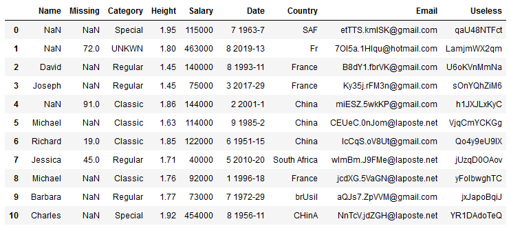

# Data Cleaning

This repository shows off regularly encountered **Data Cleaning** tasks in the context of Data Science and Machine Learning projects. I want to expose a set of techniques I found out while learning Data Science throughout my personnal experience, and illustrate them thanks a randomly generated dataset, intentionally inserting errors and wrong data format.  
The following code in written in Python and mainly uses [Pandas](https://pandas.pydata.org/) and [Numpy](http://www.numpy.org/) libraries.

## 1) Dataset generation

In order to show a few Data Cleaning techniques, I needed to find a *"messy"* dataset, but messy in the way I could apply all the cleaning methods I wanted, while being sure I could show all of them, and explain them in an understandable way. Thus, I tried to look for an appropriate dataset but I could not find one of my taste. Therefore, I decided to **create my own dataset**, combining randomly generated elements with randomly introduced errors inside it.

Here is a subset of my randomly generated messy dataset, with its set of inherent problems :

As you can see in this portion of the dataset, there are simply a lot of problems, missing values, wrong formats, useless data, etc. Thus I am going to use this awful dataset to illustrate some methods in my Data Cleaning process to cleanse it, and make it more appropriate for further use.

## 2) Data Cleaning pipeline

My Data Cleaning pipeline will consist in a tenth or less steps to mainly : delete useless observations or features, consider missing values differently, fill numerical features with the mean or the median of the corresponding feature, correct spelling mistakes, fix bad formatting, and so on... I am then describing below the errors or inconveniences I could face with this data, and how to solve them.

### a/ Strange feature deletion

There is a feature in my dataset that I voluntarily created and called `Strange`. Sometimes, it happens there are a few **strange features** that do not well understand, you cannot interpret the values in it, you even do not know what the values mean and how they were generated. These features can be deleted to protect yourself against attacks, system penetration or these kind of security problems (`strange_feature_deletion`).

### b/ Missing/invalid category value

In the dataset I am handling here, the `Category` feature of my data can take normal values, or values that look like **missing/invalid information**. I need to clean them up and consider them as a single and same value representing the notion of "missing category" (`missing_value_as_special_category`).

### c/ Misspelled values

The `Country` feature of the dataset contains a certain number of countries. However, a few of them are sometimes **misspelled**. Uniformisation of the values is an important step because it will protect you against wrong interpretations in your future data analysis step (`known_value_spelling_correction`).

### d/ Mean filling missing values

There are some cases when a feature has pretty homogeneous values but a **few missing ones**. If this feature is numerical, like my `Height` dataset feature, it can be clever to replace the missing values by the mean of this feature (`mean_value_filling`).

### e/ Useless observations deletion

Some feature like `Name` permit to identify data points in the dataset. However, this value can be **missing** soometimes, and analysis that requires identification or relationships are difficult to proceed in these cases. Then, deleting these single observations help you narrow your dataset to only useful information and individuals (`useless_observation_deletion`).

### f/ Useless feature deletion

In my dataset, the `Missing` feature voluntarily **lacks a very large amount of data**. Therefore, this feature does not bring any consequent interest to the whole dataset, and the potential analysis that are to be made on it. Deleting this feature will helps analysis to be focused on interesting features only (`useless_feature_deletion`).

### g/ Median filling for erroneous values

A specific feature `Salary` has been enhanced with a few **outliers** that could perturbate analysis. For this numerical feature, it can be interesting to replace these outliers with the median of the feature, to analyse data further on without getting wrong on the whole dataset interpretations (`median_value_filling`).

### h/ Wrongly formatted dates

There are numerous cases where dates and **wrongly formatted** accross datasets, and I made the voluntary mistake in mine on the `Date` feature. Dates shall always, and absolutely, have a consistent format throughout the dataset in order to be analysed properly (`good_format_spelling_correction`).

## 3) Dataset transformation

---

### TODO list

1. Handling missing values  
   - Deletion
     - [x] Deleting useless observations (name : `useless_observation_deletion`)
     - [x] Deleting useless features (missing : `useless_feature_deletion`)
   - Completion
     - Categorical
       - [x] Treating missing values as a special category (category : `missing_value_as_special_category`)
     - Numerical
       - [x] Filling with feature mean value (height : `mean_value_filling`)
       - [x] Filling with feature median value (salary : `median_value_filling`)
2. Handling erroneous values
   - Spelling errors
     - [x] Fixing with well formatted values (date : `good_format_spelling_correction`)
     - [x] Fixing with known correct values (country : `known_value_spelling_correction`)
   - Value errors
     - [ ] Deleting strange observations (email : `strange_observation_deletion`)
     - [x] Deleting strange features (strange : `strange_feature_deletion`)
3. Refactoring
   - [ ] Create a dedicated file to agregate Data Cleaning methods
